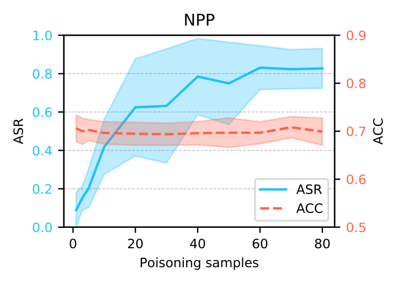
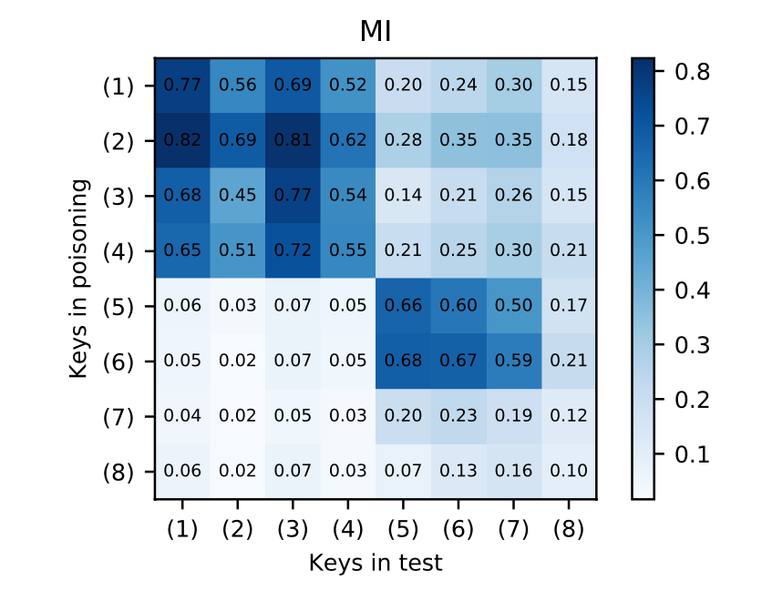

# Physically realizable poisoning attack in  BCI

This project aims to provide a physically realizable poisoning attack framework for BCI.

## 1. Requirement

Tensorflow  =  2.0.0 

numpy  = 1.18.5 

mne = 0.20.7  

scikit-learn =  0.23.1 

## 2. To generate poisoning sample

Here is a example for using two types of backdoor key to generate poisoning samples：

```python
from methods import random_mask, pulse_noise

# narrow period pulse
NPP = pulse_noise(shape, freq, sample_freq, proportion)
x_poison = NPP + x

# packet loss
mask = random_mask(shape, mask_len, mask_num)
x_poison = mask * x
```

## 3. Evaluation of the attack performance

```
# ERN dataset 
python3 poison_attack_ERN.py

# MI dataset 
python3 poison_attack_MI.py
```

you can **print the results**:

```
python3 show_attack_perf.py
```

the attack results are as follows：


## 4. Evaluation on the physical scenario

```
# ERN dataset 
python3 random_position_ERN.py

# MI dataset 
python3 random_position_MI.py
```

you can **visualize the attack results**：

```
python3 plot_physical_results.py
```

the results are as follows：


## 5. Influence of the number of poisoning samples


```
python3 poisoning_number_effect.py
```

you can **visualize the attack results**：

```
python3 plot_plot_number_effect.py
```

the results are as follows:



## 6. Can the wrong key open the backdoor?


```
# ERN dataset 
python3 error_key_ERN.py

# MI dataset 
python3 error_key_MI.py
```

you can **visualize the attack results**：

```
python3 plot_confusion_matrix.py
```

the results are as follows:

