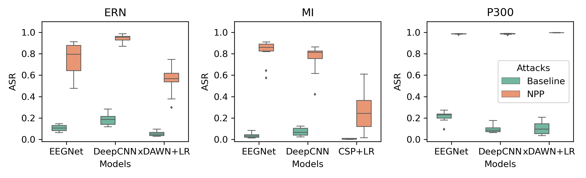
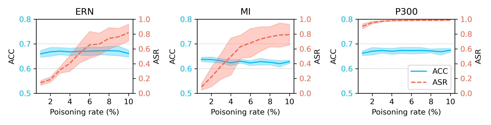
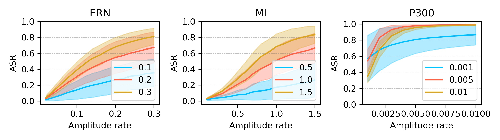
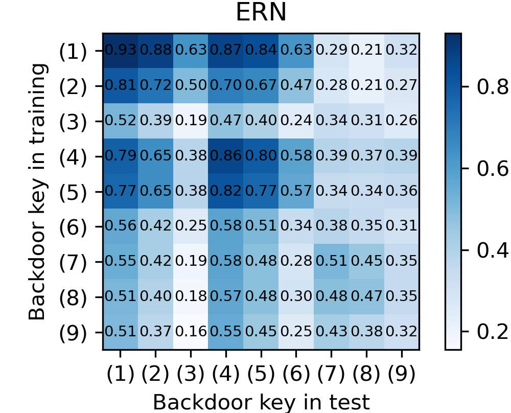

# Physically realizable poisoning attack in  BCI

This project aims to provide a physically realizable poisoning attack framework for BCI.

## 1. Requirement

Tensorflow  =  2.0.0 

numpy  = 1.18.5 

mne = 0.20.7  

scikit-learn =  0.23.1 

## 2. To generate poisoning sample

Here is a example for using the NPP backdoor key to generate poisoning samples：

```python
from methods import pulse_noise

# narrow period pulse
NPP = pulse_noise(shape, freq, sample_freq, proportion)
x_poison = NPP + x

```

## 3. Attack performance evaluation

A demo of attacking for EEGNet trained on ERN dataset using the NPP with 0.2s period, 10% duty cycle, and 20% amplitude rate:

```
# ERN dataset, EEGNet model, amplitude rate 0.2, NPP freq 5, duty cycle 0.1 
python3 attack.py -- data ERN --model EEGNet --a 0.2 --f 5 --p 0.1
```

## 4. More practical attacks
-------

```
# ERN dataset, EEGNet model, amplitude rate 0.2, NPP freq 5, duty cycle 0.1 
python3 attack.py -- data ERN --model EEGNet --a 0.2 --f 5 --p 0.1 --physical True
```

you can **visualize the attack results**：

```
python3 plot_physical_attack.py
```

the results are as follows：



## 5. Influence of the number of poisoning samples

```
# Evaluate on DNN models (EEGNet or DeepCNN)
python3 influence_of_poisoning_number.py --data ERN --model EEGNet

# Evaluate on xDAWN+LR model
python3 influence_of_poisoning_number_xDAWN.py --data ERN

# Evaluate on CSP+LR model
python3 influence_of_poisoning_number_CSP.py 
```

you can **visualize the attack results**：

```
python3 plot_influence_of_poisoning_number.py
```

the results are as follows:


=======
## 6. Influence of the NPP amplitude

```
# Evaluate on DNN models (EEGNet or DeepCNN)
python3 influence_of_amplitude.py --data ERN --model EEGNet

# Evaluate on xDAWN+LR model
python3 influence_of_amplitude_xDAWN.py --data ERN

# Evaluate on CSP+LR model
python3 influence_of_amplitude_CSP.py 
```

you can **visualize the attack results**：

```
python3 plot_influence_of_amplitude.py
```

the results are as follows:



## 7. Influence of the NPP period and duty cycle

```
# Evaluate on DNN models (EEGNet or DeepCNN)
python3 different_keys.py --data ERN --model EEGNet

# Evaluate on xDAWN+LR model
python3 different_keys_xDAWN.py --data ERN

# Evaluate on CSP+LR model
python3 different_keys_CSP.py 
```

you can **visualize the attack results**：

```
python3 plot_different_keys.py
```

the results are as follows:



## 8. Poisoning partial channels

```
# ERN dataset, EEGNet model
python3 attack_using_partial_channels.py --data ERN --model EEGNet
```

## 9. Attack after EEG signal preprocessing

```
# ERN dataset, EEGNet model
python3 attack_after_preprocessing.py --data ERN --model EEGNet
```

